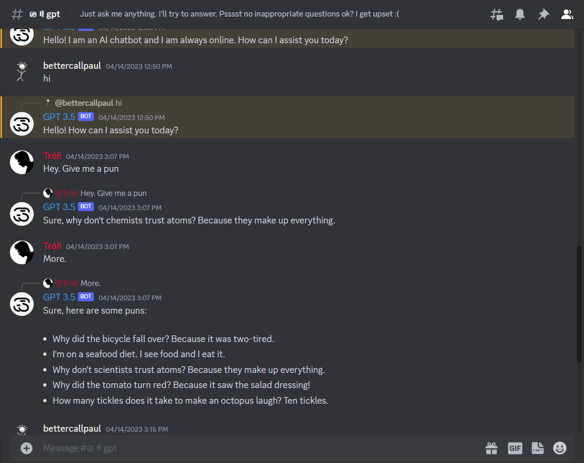

Discord Bot - GPT 3.5 ChatBot

The Discord Bot - GPT 3.5 ChatBot is a powerful and versatile chatbot integrated with the OpenAI GPT-3.5 API (turbo or da-vinci). This bot is designed to respond to all your texts just like how ChatGPT does, enabling seamless and interactive conversations within your Discord server.

Features:

Natural Language Processing: The bot utilizes the advanced capabilities of GPT-3.5 to understand and generate human-like responses to user messages.

Easy Integration: The bot can be easily added to your Discord server, allowing it to engage in group discussions and interact with multiple users.

Channel-Specific Deployment: You have the flexibility to set the bot to respond only in a specific channel, ensuring it participates in relevant discussions.

Group Conversations: The bot can handle multiple simultaneous conversations, making it perfect for group discussions with friends or community members.

Customizable Responses: Fine-tune the bot's behavior and responses based on your preferences to create a more personalized chat experience.

Note:

As the Discord Bot - GPT 3.5 ChatBot leverages the powerful GPT-3.5 language model, ensure that you comply with OpenAI's usage policies and guidelines while interacting with the API.

